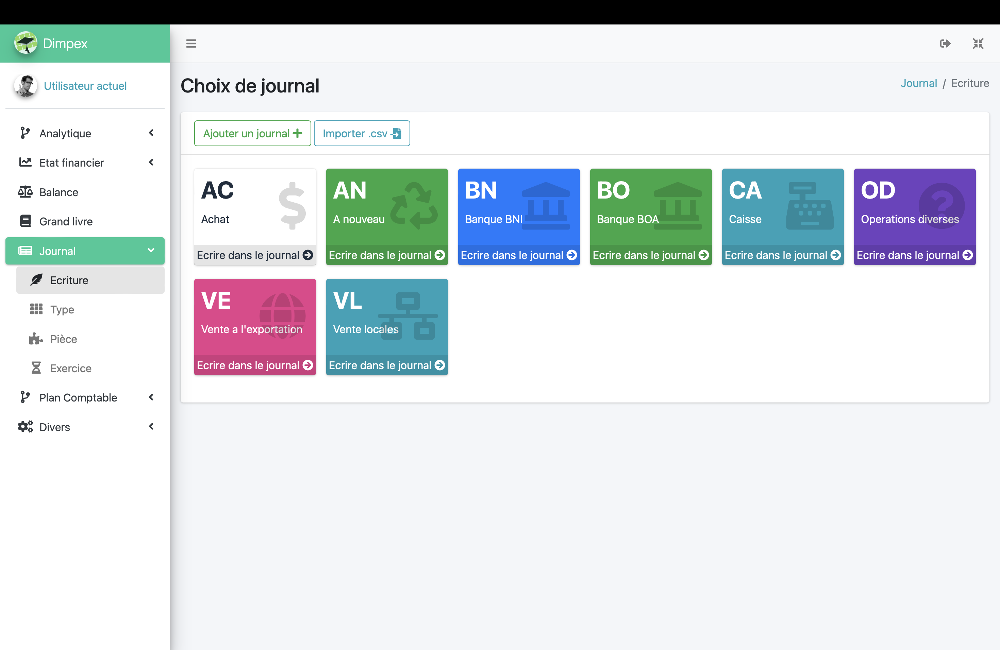
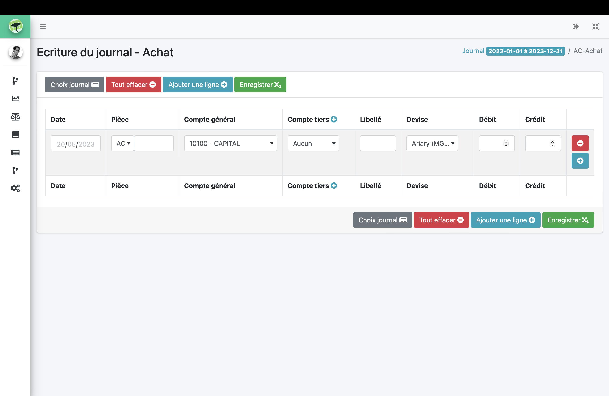
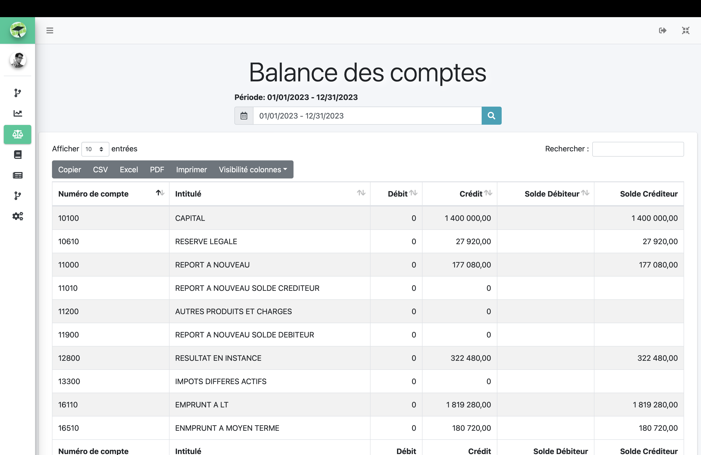
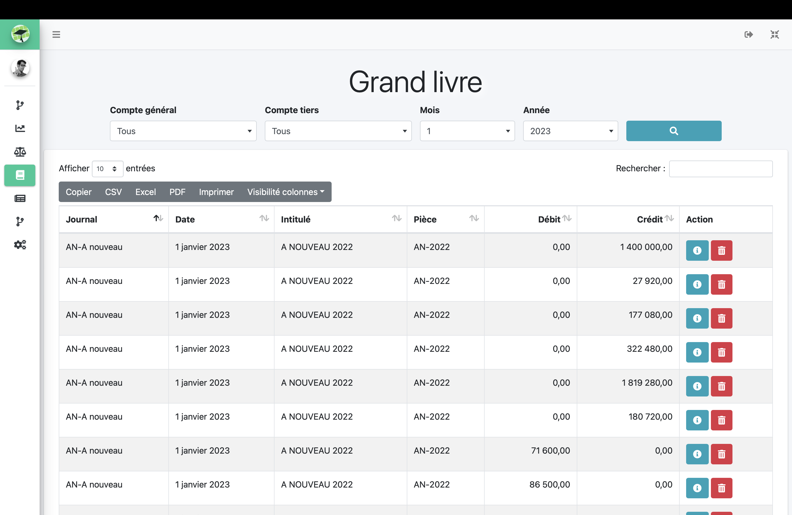
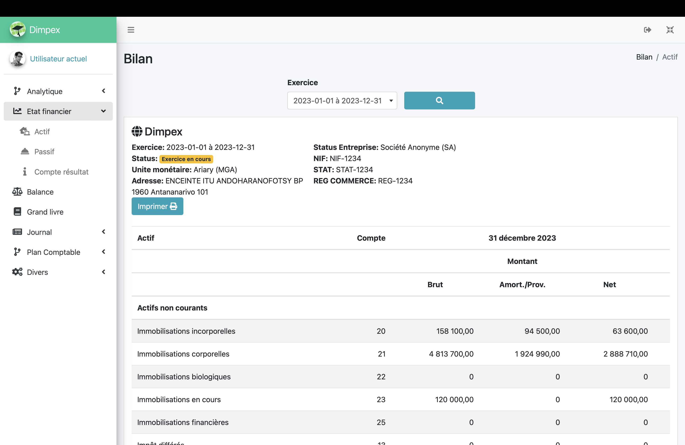
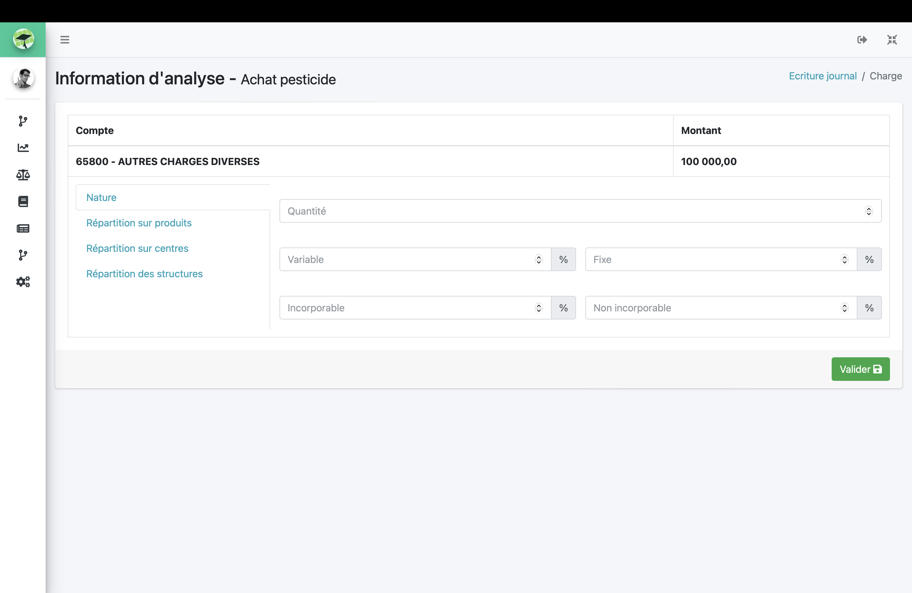
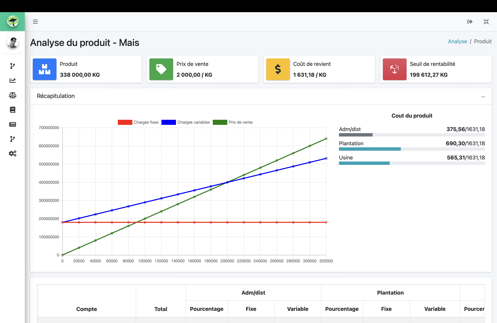
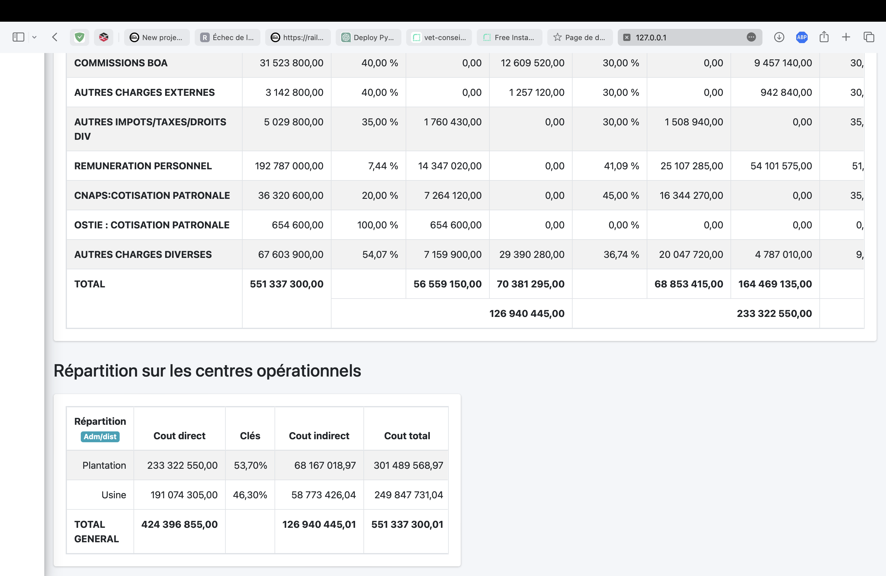
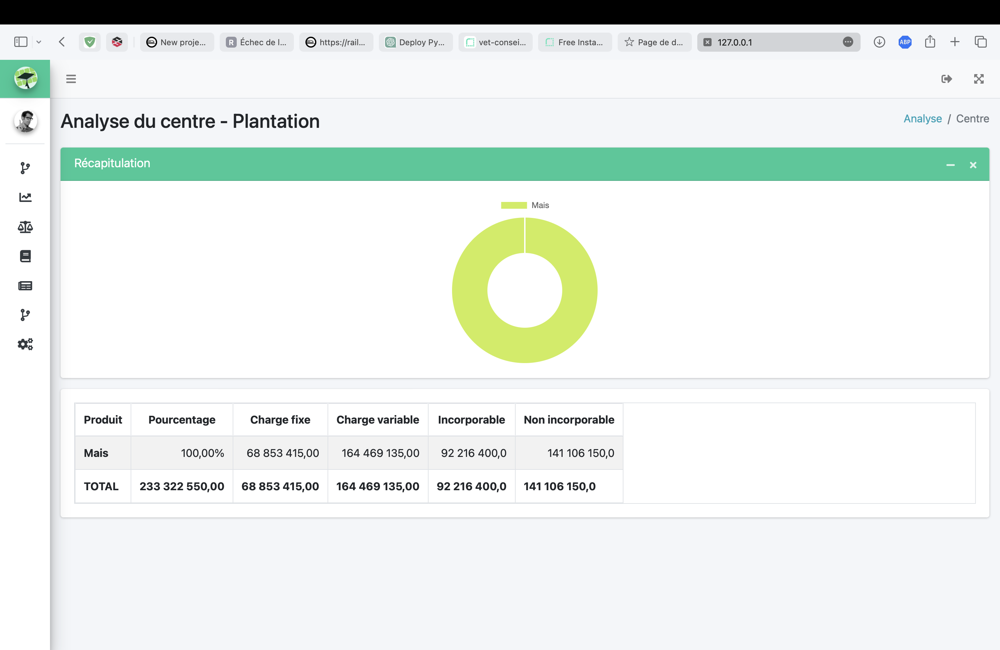
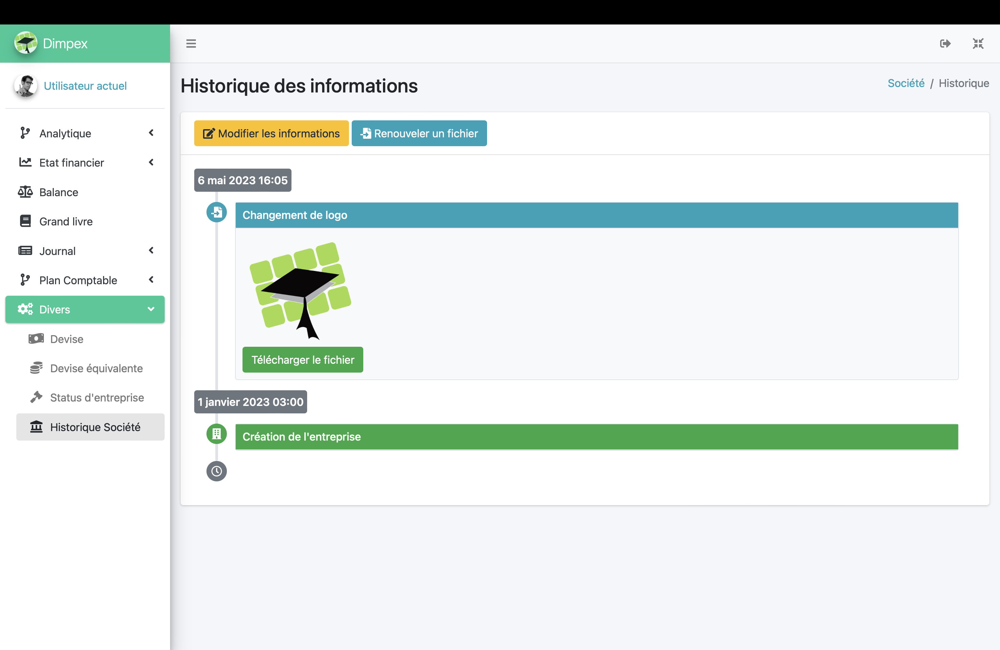

## Description
Ce projet vise à mettre en œuvre quelques notions de base de la comptabilité sous la forme d'une application web.
<br>
<br>
<a href="">
  
</a>
<a href="">
  
</a>
<a href="">
  
</a>
<br>

> Disclaimer: This project is solely intended for educational purposes and should not be considered as a fully-functional accounting application. It is a student project created to implement basic accounting concepts.

## Fonctionnalité
### La comptabilité générale
- Ecriture journal
  - 
  - 
- Balance
  - 
- Grand livre
  - 
- Etat financier
  - Bilan des actifs
  - Bilan des passifs
  - Compte de résultat


### La comptabilité analytique
- Répartition des charges (compte 6) lors de l'insertion d'une écriture
  - 
- Analyse par produit
  - 
  - 
- Analyse par centre (Structurel et Opérationnel)
  - 
  
### Diverses
- CRUD compte general, compte ties, devises, pièces, exercices...
- Historique du société
  - 
  
## Get started
### 1. Clone this repository
```git clone https://github.com/mendrika261/S4-SI-entreprise.git```
### 2. Create a virtual environment
```python -m venv venv```
### 3. Activate the virtual environment
```source venv/bin/activate```
### 4. Install requirements
```pip install -r requirements.txt```
### 5. Configure the database (Postgres)
Create a file named `.env` and add the following variables:
```
# Database configuration
ERP_DB_NAME=postgres
ERP_DB_USER=postgres
ERP_DB_PASSWORD=
ERP_DB_HOST=localhost
ERP_DB_PORT=5432
```
### 6. Make migrations
```python manage.py makemigrations```
### 7. Migrate
```python manage.py migrate```
### 8. Insert data
Insert data into the database with sql script in `sql/` folder
### 9. Create a user for login
```python manage.py createsuperuser```
### 10. Run the server
```python manage.py runserver```
